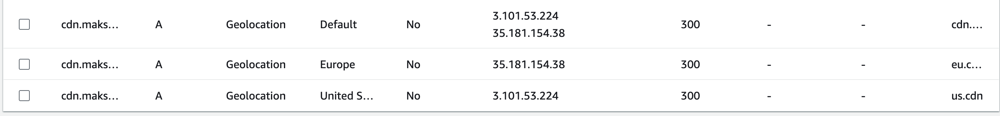
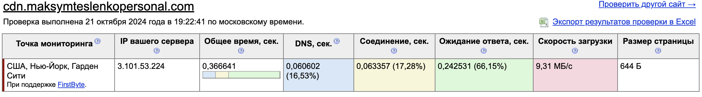
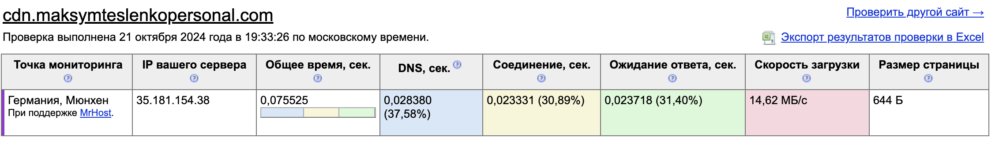
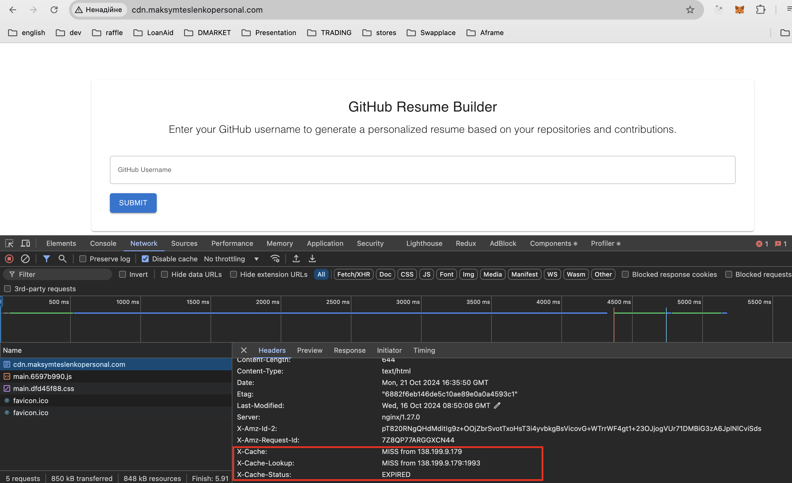
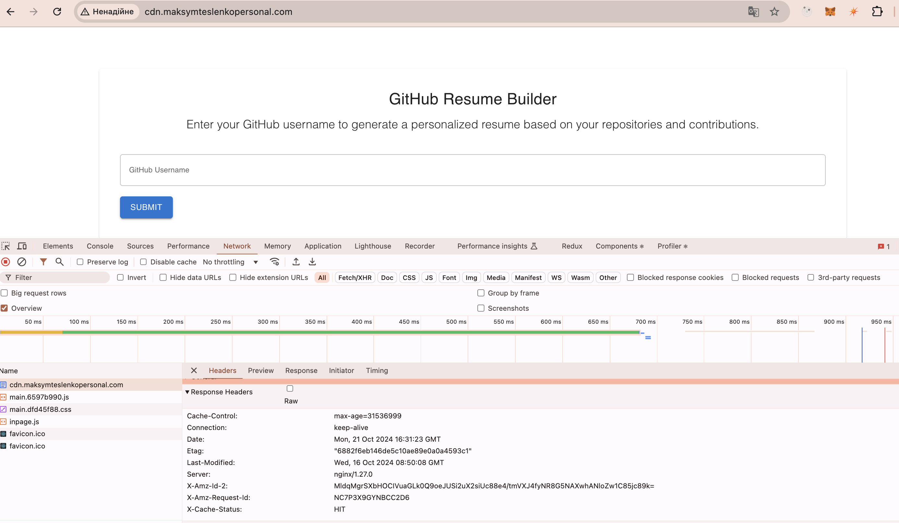

# Custom CDN Setup with Geolocation Load Balancing

This repository contains the configuration and deployment scripts for a custom Content Delivery Network (CDN) setup utilizing AWS EC2 instances as reverse proxy cache servers and NGINX-based load balancers. The CDN is configured to support geolocation-based traffic routing using AWS Route53 and geolocation load balancing, allowing users to be routed to the nearest available server.

## Architecure Overview 

The CDN setup involves:
- Reverse Proxy Cache Servers: These servers act as a caching layer for content fetched from an S3 bucket. Content is cached locally to improve performance and reduce requests to the origin.
- Load Balancers: Two NGINX load balancers, deployed in different AWS regions (US and EU), distribute traffic to their nearest reverse proxy cache servers using a "least connections" load balancing algorithm.
- Geolocation-Based Routing (Route53): DNS requests are routed based on the geographic location of the client. Clients from the US are routed to the US load balancer, while clients from Europe are routed to the EU load balancer.

## Components

1. Reverse Proxy Cache Servers:
- NGINX-based servers that cache content from a public S3 bucket.
- Configured with the ngx_cache_purge module to handle cache purging.

2. Load Balancers:
- NGINX-based load balancers deployed in US and EU regions.
- Load balancing is handled via the least connections method between multiple reverse proxy servers.

3. AWS Route 53:
- Handles geolocation-based DNS resolution.
- Routes users to the closest load balancer based on their geographic location.

## Geolocation Load Balancing

AWS Route 53 is used to direct traffic based on the client’s location:
- US Region: Traffic originating from the US is routed to the US-based load balancer, which further balances traffic between two reverse proxy cache servers in the same region.
- EU Region: Similarly, traffic from European regions is routed to the EU-based load balancer.
- Fallback (Default): Clients from regions not covered by specific geolocation policies will be routed to a default load balancer.

## Testing Setup 

### EC2 instances IPs overview

- US Based (us-west-1) load balancer IP: 3.101.53.224
- EU Based (eu-west-3) load balancer IP: 3.101.53.224

Use ec2-userdata.cdn.balancer.bash script content while initializing EC2 instance, just copy to used data option.

### Route 53 geolocation DNS configuration 

### Testing geolocation dns 

https://ping-admin.com/

1. US based load balancing 

2. EU based load balancing

### Cache status on reverse proxy cache servers

1. Cache miss:

2. Cache hit:

